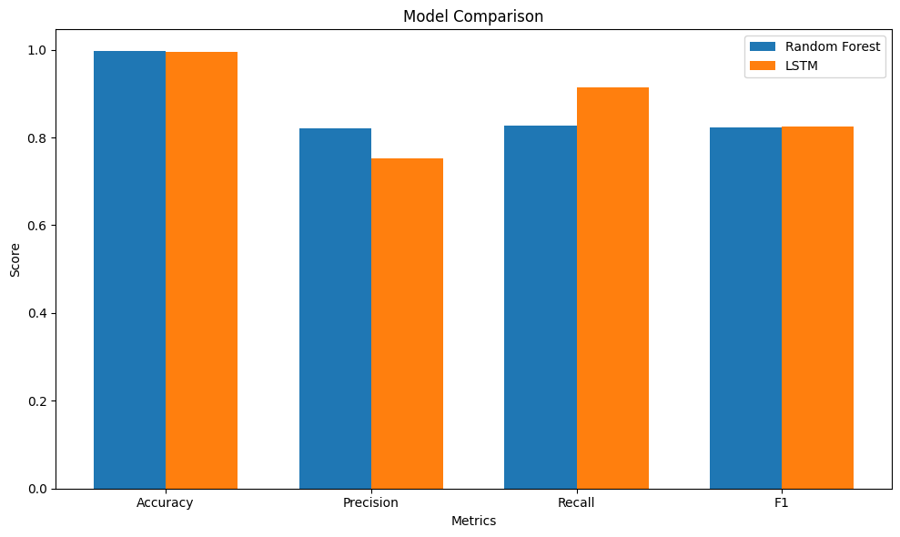

# Insider Threat Detection Using Machine Learning


## Overview
This project implements an **end-to-end machine learning pipeline** for detecting insider threats using both traditional and deep learning approaches. It leverages MLflow for model tracking and deployment to ensure reproducibility and scalability.

Key Features:
- Data preprocessing and feature engineering for structured and unstructured data.
- Model training and comparison between Random Forest and LSTM architectures.
- Integration of MLflow for tracking experiments, metrics, and model deployment.
- Benchmark visualization (e.g., `benchmarks/Model_Comparison.png`) to compare model performance.

---

## Project Structure
```plaintext
├── datasets/                     # Raw and processed data
├── notebooks/                    # Jupyter notebooks for experimentation
├── scripts/                      # Python scripts for modular pipeline tasks
├── benchmarks/                   # Performance benchmarks (e.g., Model_Comparison.png)
├── Dockerfile                    # Docker configuration
├── requirements.txt              # Python dependencies
├── README.md                     # Project documentation
```

---

## Requirements
- Python 3.8+
- GPU support for deep learning models (optional but recommended)

### Key Libraries
- `numpy`, `pandas`, `scikit-learn`
- `tensorflow`, `mlflow`, `matplotlib`, `seaborn`

Install dependencies:
```bash
pip install -r requirements.txt
```

---

## Usage
### 1. Clone the repository
```bash
git clone <repository-url>
cd <repository-folder>
```

### 2. Dataset Preparation
Place the dataset in the `datasets/` folder. This project uses the **CMU Insider Threat Dataset**.

### 3. Run the Notebook
Navigate to the `notebooks/` folder and run the Jupyter Notebook to explore and experiment with the pipeline.

### 4. Run with Docker
Build and run the project using Docker:
```bash
docker build -t insider-threat-detection .
docker run -p 5000:5000 insider-threat-detection
```

MLflow UI will be available at `http://localhost:5000`.

---

## Benchmarks
The following benchmark visualizes the performance of Random Forest and LSTM models:



---

## MLflow Integration
To enable MLflow for tracking and model management:
1. Start the MLflow server:
   ```bash
   mlflow ui --backend-store-uri file:<storage-path>
   ```
2. Access the MLflow UI at `http://localhost:5000`.

---

## Future Enhancements
- Expand dataset to include additional features for insider threat detection.
- Test advanced architectures like Transformer-based models.
- Add real-time monitoring capabilities.
